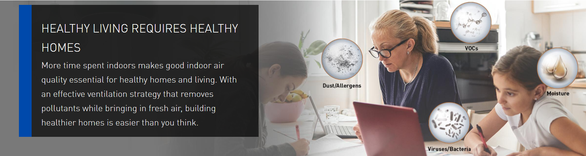

<left>


## Infographics

[IAQ Solutions](info.html)

</br>

## Website overview

<i>**Project Report**</i>: Contains a detailed report for market analysis led by IAQ .

* 1. [Potential Markets](report.html)
* 2.
* 3.

<i>**Interactive Map**</i>: Contains an interactive map showing demographic information.

<i>**Github repo & Data source**</i>: Click the icons at the right top corner to see the data source and our github repo.

</br>


```{r echo=FALSE}
#library("htmltools")
#library("vembedr")
#embed_url("https://www.youtube.com/watch?v=7tEiZqX-DDY")
```


</br>

## Motivations

According to [a study](https://www.cdc.gov/nchs/data/databriefs/db329-h.pdf), 

</br>

### Data

xxxxx 

**Link to the data source**: [data](https://catalog.data.gov/dataset/accidental-drug-related-deaths-january-2012-sept-2015)

</br>

## Initial questions

* What was the potential market ?
* Has the patterns of the existing market for ventilation changed over recent years?


</br>

## Main findings and conclusions


</br>

## Discussion
