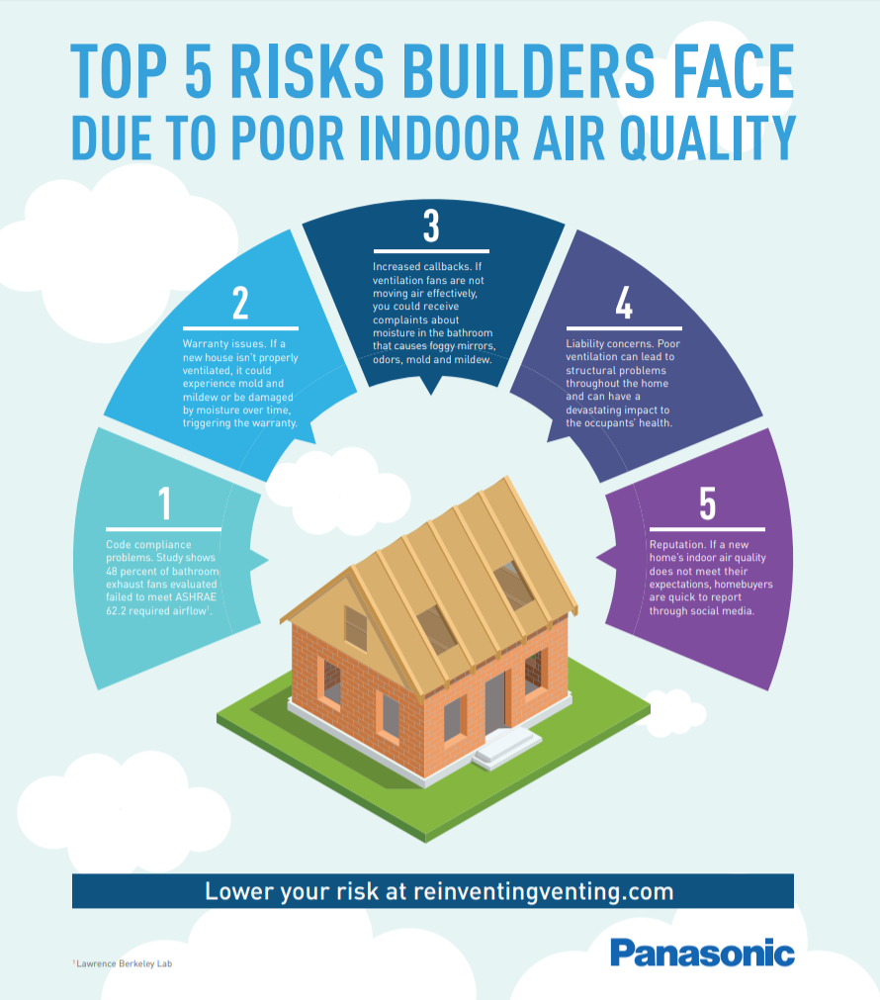

Research new market & sales opportunities (like healthcare, nursing homes, dentist office, etc).  As the World is identifying the Health risks associated with viruses like COVID, there is a big opportunity to bring existing Panasonic products to the North America Market.  The NanoX and Ziano technologies have substantial market opportunities in the following markets - Elderly Care Facilities, Doctors Offices, Dentist Offices, Individual Hospital Rooms, College Dormatories, School Classrooms, etc.  These are areas outside our current range of expertise and we need to gather a lot of information to assess the market opportunities.  The Goal of the project will be to establish sales opportunities in these areas and understand the willingness to pay for the technologies.  

