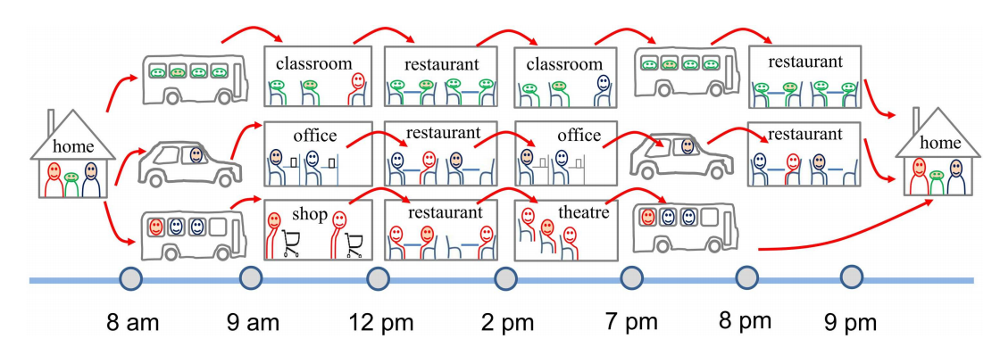
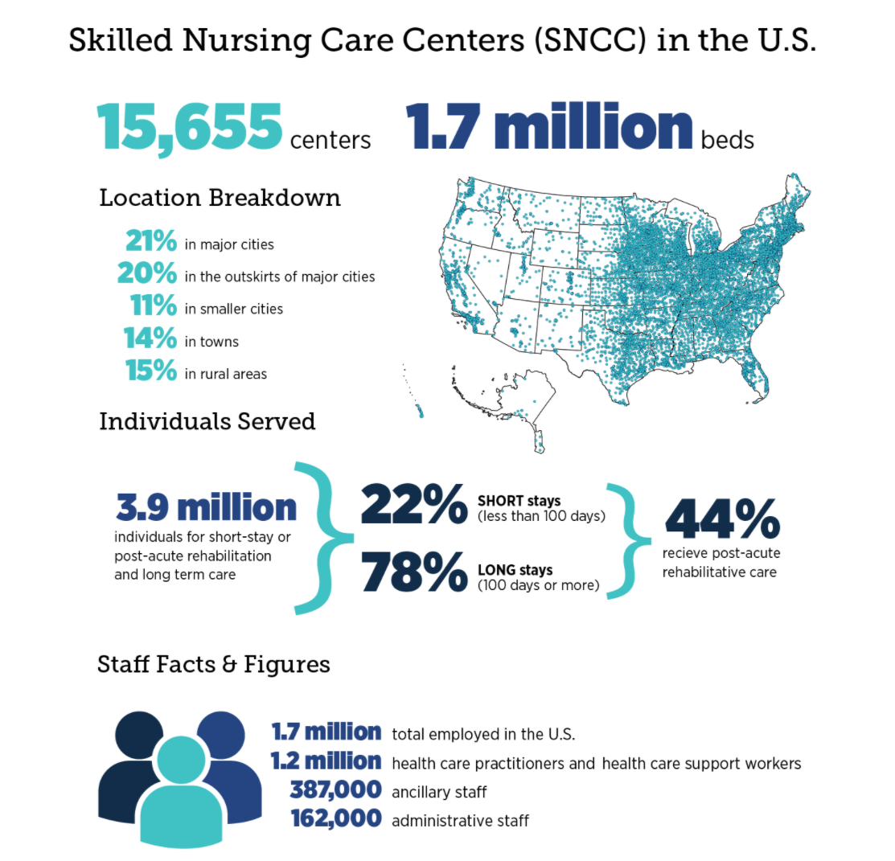
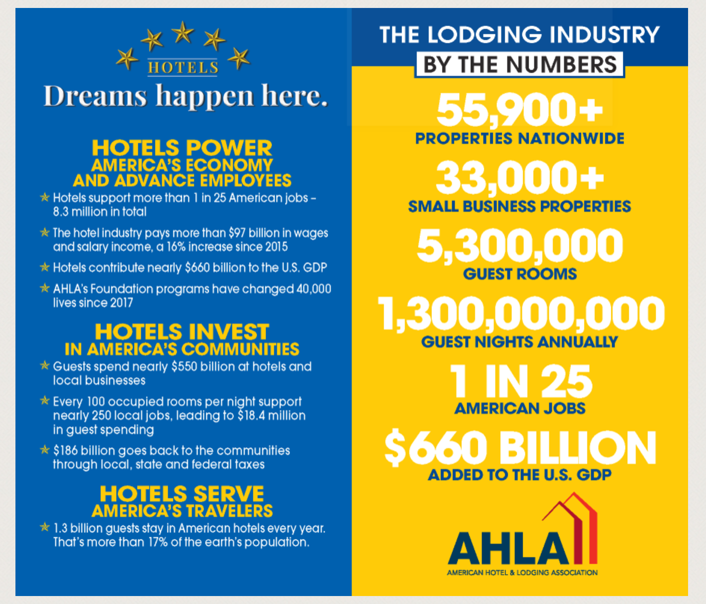
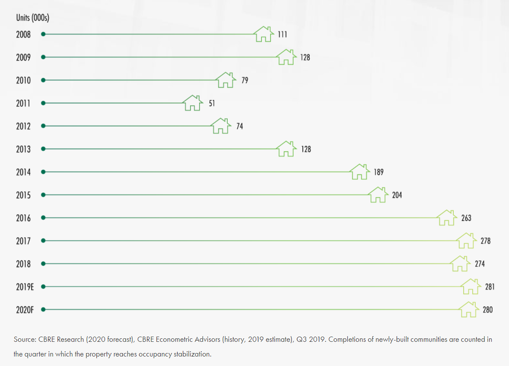
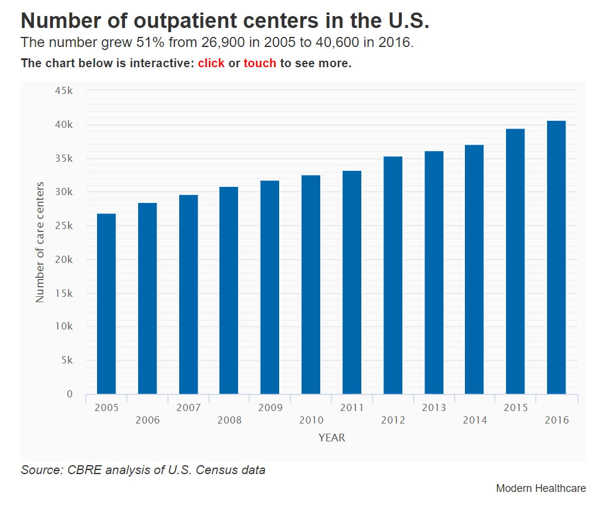

```{r setup, include=FALSE}
library(tidyverse)
library(plotly)

knitr::opts_chunk$set(
	echo = TRUE,
	warning = FALSE,
  message = FALSE,
	fig.width = 8, 
  fig.height = 6,
  out.width = "90%"
)
theme_set(theme_gray(base_size = 10) + theme(legend.position = "bottom"))
```
                                                                                

**In this project, we are going to explore some potential markets in United States and intend to discover some critical opportunities for Panasonic ventilation production **

<br>

## Motivation

    
<br>

Under the scenario of the global pandemic, the importance of indoor air quality rises as more people concerning for the spread of disease in working and public environment.

{width=95%}

Therefore, it is urgent to explore the potential model that Panasonic IAQ division could supply to public institution with some improvements in the quality of air. 


<br>

## Initial Research for Potential Markets

<br>

* Elderly Care Facilities, Day Care Centers

* Hotel Rooms

* College Dormitories, School Classrooms

* Multifamily Housing

* Doctor Office, Dentist Clinic

* Hospital Rooms

<br>

### Elderly Care Facilities, Day care centers{.tabset .tabset-pills}

<br>

#### Elderly Care Facilities

There are multiple [independent researchers](https://www.ahcancal.org/News-and-Communications/Fact-Sheets/FactSheets/Analysis-COVID-Outbreaks-in-Nursing-Homes.pdf) indicates that community spread is linked to outbreaks in nursing homes. In early March, the alarming outbreak in senior living complex, Seattle, shows the vulnerability of long-term care facilities.

[](https://www.ahcancal.org/Data-and-Research/Pages/default.aspx)


<br>

#### Opportunity

<br>

#### Day Care Centers

In year 2020, there are 643,538 existing Day Care centers in US with a total of 1,519,664 industry employment. Through year 2015-2020 the industry has a stable growth of 2.4% in revenue annually.

Although some day care centers are required to stay open,these facilities are expected to experience increased purchase costs as they must increase spending on sanitizing facilities(Toys) and personal protective equipment for employees, thus leading to an expected 8.1% decline in 2020 alone.

```{r echo=FALSE}
#library("htmltools")
#library("vembedr")
#embed_url("https://www.youtube.com/watch?v=7tEiZqX-DDY")
```

[US Day Care](https://www.ibisworld.com/united-states/market-research-reports/day-care-industry/) has four major divsions and includes following:

* In-home day care

* Center-based day care

* Pre-primary grade instructional programs

* Other services and programs


<br>


#### Opportunity

##### 1. Provide support for essential workers 
During this pandemic, the healthcare worker strived with a huge burden and  according to studies, about a quarter of the health care and first responder workforce would require child care.

Nevertheless, the potential child day care market may increase as in the later period of reopening, 34 to 43 percent of the total U.S. workforce hold jobs in industries that the Department of Homeland Security designates as critical infrastructure.

##### 2. Building sepcial-designed ventalation for children

This indoor air quality article actually suggested day care center for kids would need some more sophistically designed ventilation system. The study demonstrate that the higher prevalence rates of allergic and respiratory symptoms among young children, whose immune system is still under-developed, suggest that ventilation and plausible growth and propagation mechanisms of allergens and infectious agents be further investigated.


[{width=95%}](https://pubmed.ncbi.nlm.nih.gov/17661928/)

<br>

### Hotel Rooms{.tabset .tabset-pills}

<br>

#### Hotel Rooms

There are 54,200+ hotel properties in the United States, filling over 5 million guestrooms. There are more than 1.1 billion guests nights annually in the United States, highlighting a constant growing industry trends and increasing investments in guest experiences with spurs community growth.The most recent market growth can be viewed at [AHLA](https://www.ahla.com/sites/default/files/State%20Hotel%20Closures%20chart.pdf)

[{width=95%}](https://www.ahla.com/dreams)

<br>

#### Opportunity

##### 1. Improve air quality in the public space for high risk worker

[WHO](https://www.who.int/news-room/q-a-detail/coronavirus-disease-covid-19-ventilation-and-air-conditioning-in-public-spaces-and-buildings) would recommend on enhance the current ventilation standards for tourist accommodation and hotel workers who are considered as individuals at a medium or high risk of exposure to COVID-19. It is important to keep the air recirculation according to HVAC professional's standards.

* Generate clean-to-less-clean air movements by re-evaluating the positioning of supply and exhaust air diffusers and/or dampers and adjusting zone supply and exhaust flow rates to establish measurable pressure differentials.

* Increase central air filtration to as high as possible without diminishing design airflow. Regular inspection for  filters is required for housing and racks to ensure appropriate filter fit and check for ways to minimize filter bypass

* Ensure exhaust fans in restroom facilities are functional and operating at full capacity when the building is occupied.

##### 2. Consider seprated ventilation between hotel rooms

[Washington Post](https://www.washingtonpost.com/travel/tips/hotel-ac-ventilation-covid/) interviewed with several epidemiologists and lised their suggestions,

* Opening the window to increasing the exchanging airflow

* Holding a room vacant between guests and spacing out for air circulating

* Bringing a personal air filter could help mitigate the risk.


<br>

### College Dormitories,School Classrooms{.tabset .tabset-pills}

<br>

#### College Dormitories

This statistic shows the volume of student housing units in the United States from 2010 to 2021. In 2018, there were 2.66 million student beds in the United States, which is set to increase to 2.84 million by 2021 with the annual growth approximately 45,000 bed per year.

{width=95%}

```{r eval=FALSE, include=FALSE}

data2_1 = read_csv(file = "housing.txt",col_names = TRUE)
data2_2 = read_csv(file = "housing2.txt",col_names = TRUE)

xaxis <- list(title = "Years",
             showline = TRUE,
             showgrid = FALSE,
             showticklabels = TRUE,
             linecolor = 'rgb(204, 204, 204)',
             linewidth = 2,
             autotick = FALSE,
             ticks = 'outside',
             tickcolor = 'rgb(204, 204, 204)',
             tickwidth = 2,
             ticklen = 5,
             tickfont = list(family = 'Arial',
                             size = 12,
                             color = 'rgb(82, 82, 82)'))

yaxis <- list(title = "Number in thousands",
             showgrid = FALSE,
             zeroline = FALSE,
             showline = FALSE,
             showticklabels = FALSE)

fig = data2_1%>% 
  plot_ly(x = ~year)%>% 
  add_trace(y = ~y, type = 'bar') %>% 
  layout(title = "Student Housing Beds Delivered in U.S 2011 to 2018", xaxis = xaxis, yaxis = yaxis, margin = margin,autosize = TRUE,showlegend = FALSE) %>%
  add_trace(x = ~c(year[1], year[8]), y = ~c(y[1], y[8]), type = 'scatter', mode = 'markers', marker = list(color = 'rgba(49,130,189, 1)', size = 1))
fig%>%
  add_trace(x = ~year, y = ~y, data = data2_2,type = 'bar', name = 'Student housing supply',
            marker = list(color = '#C9EFF9'),
            hoverinfo = "text",
            text = ~paste(y, '#'))
```

*Forecast: beds under construction and planned.

#### Opportunity

<br>

#### Classrooms for PK–12 Education

One perspective would be projection on the number of [educational institutions](https://nces.ed.gov/fastfacts/display.asp?id=372#PK12_enrollment) including special education, alternative, and other schools not classified by grade span.


```{r}
library(plotly)

data3 = data.frame(
    ids = c(
    "Public schools", "Private schools", "Public schools - Elementary", "Secondary",
    "Combined", "Public schools - Other","Private schools - All"
  ),
  labels = c(
    "Public schools-98,277", "Private schools-34,576", "Elementary", "Secondary", "Combined",
    "Other","All"),
  parents = c(
    "", "",  "Public schools", "Public schools", "Public schools", "Public schools",
    "Private schools"
 ),
    v = c(0,0,66758,24040,6788,691,34576),
  stringsAsFactors = FALSE
)

plot_ly(data3, ids = ~ids, labels = ~labels, parents = ~parents,values = ~v, type = 'sunburst',  domain=list(column=1),
  maxdepth=3)%>%
  layout(
    #xaxis = list(title = ""),
    #yaxis = list(title = "", zeroline = F),
    title="Number of educational institutions,2015–16",
    colorway = c('#f0c7e0','rgba(49,130,189, 1)')
  )


```

<br>

#### Opportunity

##### 1. Poor ventilation inside schools, especially in older buildings

In fact, the U.S. Government Accountability Office said in a [report](https://www.nea.org/advocating-for-change/new-from-nea/school-ventilation-must-be-addressed-reopening-plans) in June that to prevent the spread of the coronavirus among schooling students, more than 41% of school districts need to update or replace their heating, ventilation, and air conditioning systems in at least half of their buildings.

Some major problem would be fresh air vents were blocked with insulation, zone valves were removed or defective, and fresh air dampers that allow outside air in to circulate had been disconnected or were defective.


##### 2. Prioritizes and renovate the system with existing standards
Since many states are still cooperating with limited opening,
following the instruction that only distance learning for K-12, Higher education institutions opened, with the extended implementation period, the ventilation system can be improved.

- Installing portable High Efficiency Particulate Air (HEPA) filters in rooms.

- Flushing air two hours before and after occupation.

- Upgrading MERV-8 to MERV-13 filters where appropriate.


<br>

### Multifamily Housing {.tabset .tabset-pills}

<br>

#### Multifamily Housing

For the multifamily housing market in 2020, CBRE Research predicted that permits and starts likely will fall, but not deliveries. Thus the completion amount still remain substantia. In 2020, multifamily completions will total 280,000 units, on par with 2019’s estimated 281,000 units.

Permits, starts and completions were all at or near this cycle’s highest levels in 2019.Development will continue in both urban and suburban locations next year and no doubt, multifamily developers will remain very active in 2020. 

[](https://www.cbre.us/research-and-reports/2020-US-Real-Estate-Market-Outlook-Multifamily)

<br>

#### Opportunity


<br>

##### 1.Dilution Ventilation vs. Displacement Ventilation


Displacement ventilation leads to cleaner air comparing to the mixing ventilation, as contaminants are removed from the occupied zone in a room towards the ceiling, as well as minimizing drafts.

With displacement ventilation, air is introduced at low velocity into a room at a low level and is exhausted at the ceiling. The flow of air is maintained by convective forces, which also have the effect of the concentration of pollutants rising from floor to ceiling. 

For now, displacement ventilation is used mostly in Europe, and rarely in residential applications.

[](https://www.me.psu.edu/cimbala/me405/Lectures/Dilution_vs_Displacement_Ventilation.pdf)


<br>

##### 2.Ensure adequate ventilation

According to [CDC](https://www.cdc.gov/coronavirus/2019-ncov/community/multifamily-housing.html#GuidingPrinciples)'s latest guideline, multifamily housing need to be aware of following standards and more:

* Disable demand-controlled ventilation (DCV) controls that reduce air supply based on occupancy or temperature during occupied hours.

* Use portable high-efficiency particulate air (HEPA) fan/filtration systems to help enhance air cleaning, especially in higher risk areas such as common spaces.

* Generate clean-to-less-clean air movement by re-evaluating the positioning of supply and exhaust air diffusers or dampers, especially in higher-risk areas such as common spaces.

* Consider using ultraviolet germicidal irradiationpdf iconexternal icon (UVGI) as a supplement to help inactivate SARS-CoV-2, especially if options for increasing room ventilation are limited.

* Consider running the HVAC system at maximum outside airflow for 2 hours before and after the space is occupied.

<br>

### Doctors' Office, Dentist Clinic {.tabset .tabset-pills}

<br>

#### Doctors' Office & Outpatient Clinic

Centers for Disease Control(CDC) has published statistics on the [Office-based Physician Visits, 2016](https://www.cdc.gov/nchs/products/databriefs/db331.htm), in 2016, there were an estimated 883.7 million office-based physician visits in the United States and there were an estimated 278 office-based physician visits per 100 persons.

[{width=95%}](https://www.modernhealthcare.com/article/20181220/NEWS/181229992/number-of-outpatient-facilities-surges-as-industry-values-more-convenient-affordable-care#:~:text=Number%20of%20outpatient%20centers%20in,2005%20to%2040%2C600%20in%202016)

As one doctor would treat approximately 4 patients who would visit 3 times annually, the doctor offices in United States would be at least 73,641,666 in 2016.

However, the prediction for doctor offices would also be affect by the numbers of hospital, the budget and growth of full time equivalent for doctors.

<br>

#### Opportunity

<br>

#### Dentist Clinic

The guidelines from [US Oral Health Workforce Projections, 2017-2030](https://bhw.hrsa.gov/sites/default/files/bhw/health-workforce-analysis/research/projections/oral-health-2017-2030.pdf) showed that the national demand for dentists is projected to increase by 9 percent acrossing the industry to 206,850 FTEs in 2030, while the demand for pediatric dentists (2 percent) and orthodontists (-1 percent) is expected to grow slowly or not at all (Exhibit 1).
```{r}
library(plotly)
data1 = read_csv(file = "dentist_2030.txt",col_names = TRUE)

data1%>%
   plot_ly(x = ~type, y = ~percent, color = ~type, colors = "Greens",type = "bar")
```

**The projection of the overall dentists'office in 2030 in the US would be 1,344,525**

Adjusting for the number of offuce in practical, [Current standards](https://blog.hjtdesign.com/how-many-dental-operatories) suggest that five to eight operatories may be the perfect and the number for any office with a single dentist and the working environment should include following features:

* 3 operation room per dentist at least

* 2 full-time hygienists’ operating room

* 1 optional common office managing the flow of traffic

<br>


#### Opportunity

##### 1. Sepical designs to tackle patient flow issues

Usually, there will be up to 300 patients share this room during consulting hours in the mornings and afternoons. The current outbreak of Covid-19 has already burden the medical system, which remarks the importance of a frequently ventilated and disinfected public areas. The ventilation rate should increase from a mean of 6.5 ACH to 15 ACH with the new design in the general outpatient waiting room.

* The waiting area for general outpatients (including most medical specialties, surgery and psychiatry) is located in the large hall shown in the photograph. 

* The consulting rooms lead off from both sides of this waiting hall. 

##### 2. Prevent cross-infection between doctors and patients

[{width=95%}](http://www.zjkcsj.cn/newsshow.php?cid=5&id=295)

* Hospitals should set up mechanical ventilation systems in different zones. (clean areas, contaminated areas, buffer rooms)

* Admission inspection in contaminated areas (negative pressure) and the mechanical ventilation system of the discharge disinfection treatment area (positive pressure) should be set up independently, and should not be used in combination with the ward.

* Adopt positive pressure buffer isolation method, that is, set the air supply not less than 30 times/h in **passage area**.
The compartment is equipped with a short D300 ventilation pipe, and the airflow flows from the clean area to the isolation area. 


<br>

### Hospital Rooms {.tabset .tabset-pills}


#### Hospital Rooms

US hospital system has four major divsions and includes following

* U.S. Community hospital —— 84.60%


* Federal Government Hospitals —— 3.40%


* Nonfederal Psychiatric Hospitals —— 10.00%


* Other Hospitals for nonfederal long term care hospitals and hospital units within an institution such as a prison hospital or school infirmary —— 2.00%

There are of total 6,146 US hospital from the AHA hospital statistic published 2018 statistics, where staffed beds could count up to 924,107. 

Comapring to the total of 5,534 US hospital in 2016, the CAGR accounts for 5.376%

[](https://www.aha.org/statistics/2020-01-07-archived-fast-facts-us-hospitals-2019)

<br>

#### Opportunity


##### 1. Airborne Infections Isolation (AII) Room

AII room, also known as Negative pressure ward, has a [restrctive setting](https://www.cdc.gov/tb/webcourses/course/chapter7/7_infection_control_7_infection_control_program_airborne_infection_isolation_aii_room.html) guide by CDC. 

A special high efficiency air (HEPA) filter that removes most (99.97%) of the droplet nuclei before it is returned to the general circulation has to be implemented.
<br>

##### 2. The Increment for Single Patient Rooms 

["The Use of Single Patient Rooms versus Multiple Occupancy Rooms
in Acute Care Environments"](https://www.healthdesign.org/sites/default/files/use_of_single_patient_rooms_v_multiple_occ._rooms-acute_care.pdf)strongly suggested that it is critical that infected patients or patients highly susceptible to infections need to be isolated in private rooms with proper ventilation. 

What's more, preliminary findings at Bronson Methodist Hospital in Michigan demonstrate that private rooms, with well-design air-flow have resulted in a 10 to 11 percent decline in overall nosocomial infections rates 


