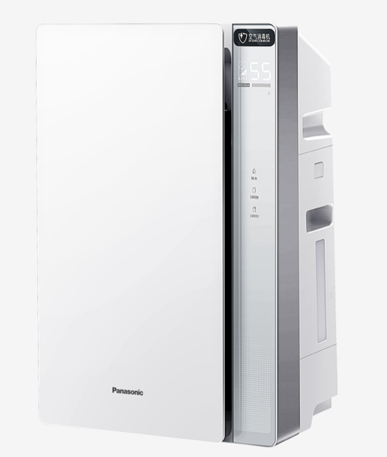
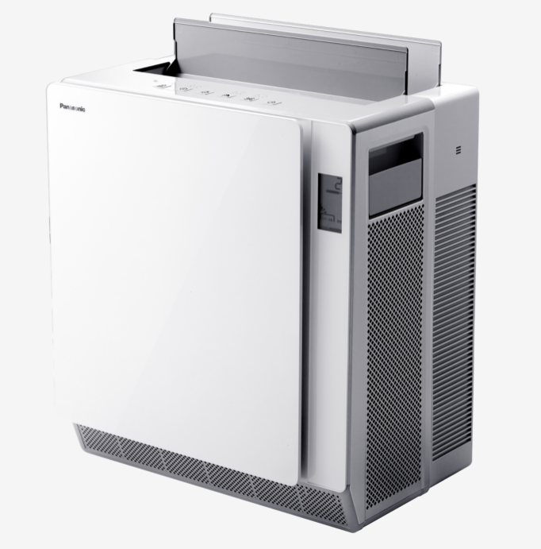

## Ventilation and Coronavirus (COVID-19)


**An important approach to lowering the concentrations of indoor air pollutants or contaminants including any viruses that may be in the air is to increase ventilation – the amount of outdoor air coming indoors. Ensuring proper ventilation with outside air can help reduce the concentration of airborne contaminants, including viruses, indoors. **

**The ventilation rate should be based on the number of people that occupy an indoor space (and a few other factors), people should give special consideration to increased ventilation when occupancy increases and for areas with high-traffic.**

**Improving ventilation also benefits indoor air quality by reducing exposure to products used for cleaning and disinfecting potentially contaminated surfaces.**

**When used along with other best practices recommended by CDC and others, increasing ventilation can be part of a plan to protect people indoors.**


* Elderly Care Facilities, Day Care Centers

* Hotel Rooms

* College Dormitories, School Classrooms

* Apartment Building

* Doctor Office, Dentist Clinic

* Hospital Rooms

<br>

## **Current Ventilation Principles**

<br>

### Elderly Care Facilities, Day Care Centers

<br>

Senior living
https://www.nafahq.org/wp-content/uploads/Moeller.pdf


daycare
https://nrckids.org/cfoc/database/5.2.1.1#:~:text=For%20child%20care%2C%20ANSI%2FASHRAE,Environmental%20Conditions%20for%20Human%20Occupancy.

```{r}
#popupGraph
#popupGraph(
 # './images/hotel.PNG',
  #width = 300,
  #height = 300)
```


### Hotel Rooms

<br>


### College Dormitories, School Classrooms


<br>


### Apartment Building


<br>


### Doctor Office, Dentist Clinic


<br>


### Hospital Rooms


<br>


## **Market Competitors**


<br>

## **Panasonic Solutions**


### Heating, Ventilation and Air Conditioning (HVAC) {.tabset .tabset-pills}

<br>


### High Efficiency Particulate Air (HEPA) {.tabset .tabset-pills}

<br>

#### Asia {.tabset}

Including products from Great China, Japan, Malaysia

<br>

##### Air Purifiers

1. [F-PDS90C](https://consumer.panasonic.cn/product/home-living/air-purifier-dehumidifier/air-purifier/f-pds90c.specs.html)

* 4-fold gradient purification, multi-directional filtration of air
* AUK professional certification to reduce 7 major allergens
* Equipped with dust sensor and air pollution indicator display

2. [F-VJL55C2](https://consumer.panasonic.cn/product/home-living/air-purifier-dehumidifier/empty-disinfecting-machine/f-vjl55c2.specs.html)
 
* ASEPTIC FEELING-clean bacteria technology
* High-efficiency composite filter, filter out 10 kinds of bacteria, reduce 7 major allergens 
* Fog-free humidification technology to prevent bacterial growth

[{width=29.6%}](https://consumer.panasonic.cn/product/home-living/air-purifier-dehumidifier/air-purifier/f-pds90c.html)  [{width=31%}](https://consumer.panasonic.cn/product/home-living/air-purifier-dehumidifier/empty-disinfecting-machine/f-vjl55c2.html) [{width=35%}](https://consumer.panasonic.cn/product/home-living/air-purifier-dehumidifier/air-purifier/f-pds130c.html)

3.[F-PDS130C](https://consumer.panasonic.cn/product/home-living/air-purifier-dehumidifier/air-purifier/f-pds130c.specs.html)

* $710m^{3}/h$ Clean Air Delivery Rate(CADR)
* 3 airflow modes, precise purification
* 99.99% space sterilization rate, nearly 100% peace of mind


##### HEPA Composite Filter

1.F-ZXSL40C

* Recommended renewal frequency: 2 years
* Compatible with F-VXL40C

2.F-ZXJP90C

* Recommended renewal frequency: 10 years
* Compatible with [F-VXJ90C](https://consumer.panasonic.cn/product/home-living/air-purifier-dehumidifier/air-purifier/f-vxj90c.html)

[{width=35%}](https://consumer.panasonic.cn/product/home-living/air-purifier-dehumidifier/air-purifier-dehumidifier-accessories/f-zxsl40c.html)  [{width=35%}](https://consumer.panasonic.cn/product/home-living/air-purifier-dehumidifier/air-purifier-dehumidifier-accessories/f-zxsl40c.html)  

3.F-ZXKP55C

* Recommended renewal frequency: 5 years
* Compatible with F-655FCV,F-5F5FCV,F-VK655C,F-VK5F5C


4.F-ZXKP40C

* Recommended renewal frequency: 5 years
* Compatible with F-41C4VX,F-VXK40C


[{width=35%}](https://consumer.panasonic.cn/product/home-living/air-purifier-dehumidifier/air-purifier-dehumidifier-accessories/f-zxsl40c.html)  [{width=35%}](https://consumer.panasonic.cn/product/home-living/air-purifier-dehumidifier/air-purifier-dehumidifier-accessories/f-zxsl40c.html)


https://www.panasonic.com/my/consumer/air-solutions/air-purifier.html


#### Europe

https://www.aircon.panasonic.eu/GB_en/ranges/domestic/

#### Middle East

https://www.panasonic.com/middleeast/en/consumer/air-solutions/air-purifiers.html


### Nanoe™ Technology

