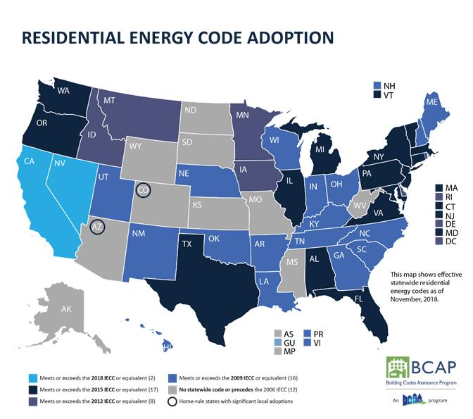
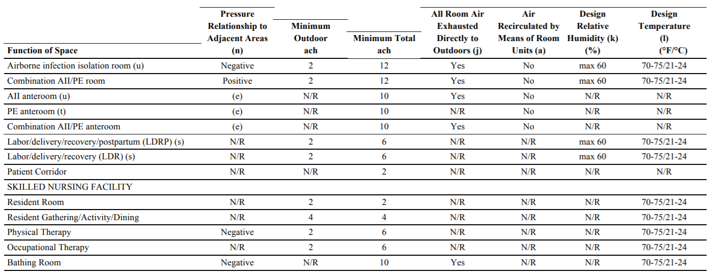
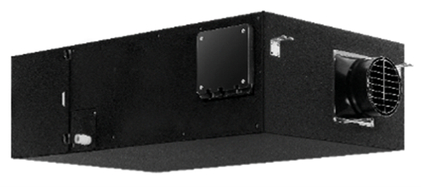
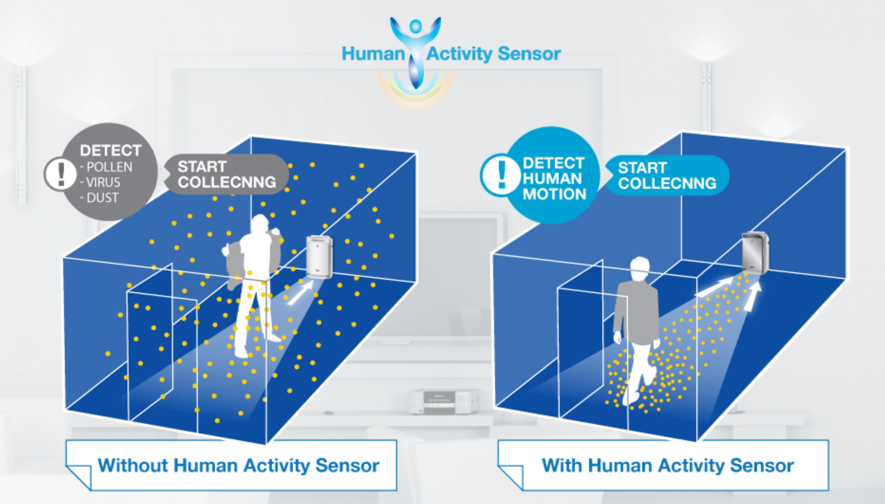
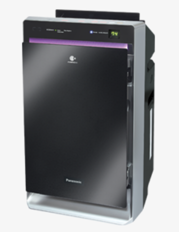
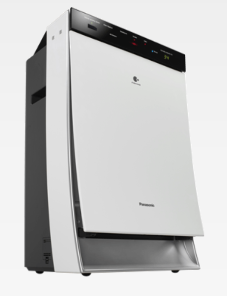

## Ventilation and Coronavirus (COVID-19)


**An important approach to lowering the concentrations of indoor air pollutants or contaminants including any viruses that may be in the air is to increase ventilation – the amount of outdoor air coming indoors. Ensuring proper ventilation with outside air can help reduce the concentration of airborne contaminants, including viruses, indoors. **

**The ventilation rate should be based on the number of people that occupy an indoor space (and a few other factors), people should give special consideration to increased ventilation when occupancy increases and for areas with high-traffic.**

**Improving ventilation also benefits indoor air quality by reducing exposure to products used for cleaning and disinfecting potentially contaminated surfaces.**

**When used along with other best practices recommended by CDC and others, increasing ventilation can be part of a plan to protect people indoors.**


* Elderly Care Facilities, Day Care Centers

* Hotel Rooms

* College Dormitories, School Classrooms

* Multifamily Housing

* Doctor Office, Dentist Clinic

* Hospital Rooms

<br>

## *What is ASHRAE?*

[ASHRAE](https://www.ashrae.org/) stands for the American Society of Heating, Refrigerating and Air-Conditioning Engineers, which is the technical body that develops and maintains ventilation standards for the United States. Ventilation codes and energy efficiency programs throughout the U.S. are based on ASHRAE standards.

Since most of our discussion would be based on the ASHRAE standards, here is a brief overview of the most popular subsegment principles in ASHRAE.

<br>

### What is ASHRAE Standard 62.2?

Formed in 1996, the ASHRAE 62.2 committee developed and maintains a residential ventilation standard for buildings three stories and less which is titled Ventilation and Acceptable Indoor Air Quality in Low-Rise Residential Buildings. It is reviewed and revised every three years. The first version of Standard 62.2 was published in 2003, the second in 2007, and the most current version is ANSI/ASHRAE Standard 62.2-2010. (ANSI stands for the American National Standards Institute. ANSI certification of a standard means that a specific consensus process was used to develop and maintain the standard and is required for adoption of a standard into codes.)

ASHRAE Standard 62.2 is the ventilation standard that applies to low-rise residential buildings of three stories or less in the U.S. ASHRAE Standard 62.1 applies to all other buildings.

<br>


### What is ASHRAE Standard 170?

Developed in partnership with Facility Guidelines Institute (FGI) and American Society of Health Care Engineering (ASHE), ASHRAE Standard-170 has been providing key guidance for ventilation requirements for health care industry facilities since 2008. Use Standard 170-2017 alongside HVAC Design Manual for Hospitals and Clinics for comprehensive design guidance on hospitals, nursing and outpatient facilities. 


<br>

### When ASHRAE Standard is Not Enough
Is ASHRAE Standard 62.2/170 current best practice for ventilation? 

In a word, no. The standard that national experts could agree upon that sets a minimum standard for ventilation — not best practice, which would further customize ventilation rates based on factors such as number of occupants in a dwelling and strength of pollutant sources.

Meeting the ventilation requirements for ASHRAE Standard 62.2 will not always provide enough ventilation for a home. In these circumstances, ventilation rates need to be increased beyond the Standard.

* The Standard does not address high-polluting events such as painting, cleaning, smoking or construction projects.
* The Standard does not address the use of unvented combustion space heaters such as unvented decorative gas appliances and kerosene heaters, which are not allowed in California.
* The Standard assumes one person per bedroom, with two people in the master bedroom. Higher numbers of occupants will increase ventilation needs.
* Occupants with health issues such as asthma and allergies may benefit from increased ventilation and/or filtration.

<br>

### Residential Energy Code

```{r}
colorize <- function(x, color) {
  if (knitr::is_latex_output()) {
    sprintf("\\textcolor{%s}{%s}", color, x)
  } else if (knitr::is_html_output()) {
    sprintf("<span style='color: %s;'>%s</span>", color, 
      x)
  } else x
}
```

[{width=95%}](https://www.wbdg.org/resources/energy-codes-and-standards) 

* **`r colorize("Meets or Exceeds 2018 (2 states)", "lightblue")`**
* **`r colorize("Meets or Exceeds 2015 (17 states)", "black")`** 
* **`r colorize("Meets or Exceeds 2012 (8 states)", "darkblue")`**
* **`r colorize("Meets or Exceeds 2009 (16 states)", "blue")`**
* **`r colorize("No states code or Procedes 2006 (12 states)", "grey")`**
* **`r colorize("AZ/CO:Home rule states with significant adoption (2 out of 12 states)", "grey")`**

<br>

## **Current Ventilation Principles**

```{r message=FALSE, warning=FALSE, paged.print=TRUE}
library(tidyverse)
library(kableExtra)
PRC = readxl::read_excel("PRC.xlsx")
knitr::kable(PRC[1:14,], caption = "Ventilation Principles")%>%
  kable_styling(bootstrap_options = "striped", full_width = F,font_size = 12)%>%
  kable_material(c("striped", "hover"),full_width = FALSE)%>%
  row_spec(10, bold = T,background = "White")%>%
  row_spec(11:14, bold = F, background = "lightskyblue")%>%
  row_spec(1:3, bold = F, background = "lightyellow")%>%
  row_spec(5:6, bold = F, background = "lightpink")%>%
  row_spec(8:9, bold = F, background = "lightgreen")
#%>%
 # scroll_box(width = "900px")
  #column_spec(2, color = spec_color(mtcars$mpg[1:8]),
  #            link = "https://haozhu233.github.io/kableExtra/") %>%
  #column_spec(6, color = "white",
   #           background = spec_color(mtcars$drat[1:8], end = 0.7),
    #          popover = paste("am:", mtcars$am[1:8]))

#devtools::install_github("haozhu233/kableExtra")
```
https://www.ashrae.org/file%20library/technical%20resources/standards%20and%20guidelines/standards%20addenda/170-2017/170_2017_p_20200302.pdf

http://sspc170.ashraepcs.org/pdf/170-2008(with_a,b,d,e,f,g)_edits.2.pdf

https://smartairfilters.com/en/blog/ventilation-rates-office-home-school-virus/


*Note: NR = no requirement*


<br>

### Elderly Care Facilities

[The nursing home](https://app.leg.wa.gov/wac/default.aspx?cite=388-97-4040&pdf=true) must ensure following:

* Ventilation of all rooms is designed to prevent objectionable odors, condensation, and direct drafts on the residents;

* All habitable space is mechanically ventilated including:

  * Air supply and air exhaust systems;
  * Installation of air-handling duct systems according to the requirements of the International Mechanical Code and chapter 51-52 WAC;
  * Installation of supply registers and return air grilles at least three inches above the floor;
  * Installation of exhaust grilles on or near the ceiling
  * Outdoor air intakes located a minimum of twenty-five feet from the exhaust from any ventilating system

The nursing home must locate the bottom of outdoor air intakes serving central systems a minimum of three feet above adjoining grade level or, if installed through the roof, three feet above the highest adjoining roof level.


<br>

### Day Care Centers

According to [U.S. General Services Administration](https://www.wbdg.org/FFC/GSA/chilcare.pdf), the day care center's ventilation design should follow following instructions:

Design ventilation systems to allow zero exposure of non-smokers to environmental tobacco smoke (ETS) even if smoking is limited to outdoor areas, as described in LEED Version 2.0. Design ventilation systems to achieve an air-change effectiveness of minimum 0.9 per ASHRAE 129- 1997 and as described in LEED Version 2.0. Locate air return over diaper and toilet areas

[](https://www.ashrae.org/File%20Library/Technical%20Resources/Standards%20and%20Guidelines/Standards%20Addenda/62.1-2016/62_1_2016_s_20190726.pdf)

<br>

```{r}
#popupGraph
#popupGraph(
 # './images/hotel.PNG',
  #width = 300,
  #height = 300)


#Senior living
#https://www.nafahq.org/wp-content/uploads/Moeller.pdf


#daycare
#https://nrckids.org/cfoc/database/5.2.1.1#:~:text=For%20child%20care%2C%20ANSI%2FASHRAE,Environmental%20Conditions%20for%20Human%20Occupancy.
```


### Hotel Rooms

For hotel/motel guestrooms and high-rise residential spaces. The sum of the operable open areas must total at least 5 percent of the floor area of each space that is naturally ventilated. The openings must also be readily accessible to the occupants of the space at all times.

Airflow through the openings must come directly from the outdoors; air may not flow through any intermediate spaces such as other occupied spaces, unconditioned spaces, corridors, or atriums. High windows or operable skylights need to have a control mechanism accessible from the floor.

[](https://energycodeace.com/site/custom/public/reference-ace-2013/index.html#!Documents/43ventilationrequirements.htm)

<br>


### College Dormitories

One thing that College dorms differ from hotel would be that during summer vacations schools are intermittently occupied. It is important to consider hot or humid climates and mechanically cooled the college dormitories and military barracks that are unoccupied for long periods.

[{width=70%}](https://www.ashrae.org/File%20Library/Technical%20Resources/Standards%20and%20Guidelines/Standards%20Addenda/62.1-2016/62_1_2016_s_20190726.pdf)

<br>

### School Classrooms

The ventilation system in classrooms such that air from the science rooms are not recirculated into non-science areas.

In chemical storage rooms, the ventilation system shall exhaust the air to the outside, and shall not be recirculated back into space. There is no minimum ventilation rate called out.

An exhaust fan controlled by the Instructor shall be provided in all rooms where hazardous or vaporous chemicals are to be used or stored. The exhaust fan shall be of sufficient size to exhaust the total volume of the room within 15 minutes.

Referring back to the minimum ventilation rate given by ANSI/ASHRAE 62.1.


[](https://www.ashrae.org/File%20Library/Technical%20Resources/Standards%20and%20Guidelines/Standards%20Addenda/62.1-2016/62_1_2016_s_20190726.pdf)

<br>


### Multifamily Housing

Research has shown that [multifamily units](https://homes.lbl.gov/ventilate-right/upgrading-multifamily-buildings) have less infiltration of outside air but mostly the air leakage through common walls and ceilings brings in air from the neighbors. Thus to provide adequate whole-building ventilation, multifamily units often need higher levels of mechanical ventilation to compensate for less infiltration.

Section 8 in Addendum j to ASHRAE 62.2-2010 covers multifamily units, which includes higher required airflows for whole-building ventilation, plus air-sealing requirements between units in multifamily buildings.


Additionally, in recent ASHRAE Standard 62.2-2016 requires a vented kitchen range hood with a minimum intermittent exhaust flow of 100 cfm or local kitchen area intermittent ventilation of 5 ach. Bathroom exhaust is also required at a minimum intermittent rate of 50 cfm or a continuous rate of 20 cfm.

What's more the choice of supplemental dehumidification is made by climate location according to [US department of energy](https://www1.eere.energy.gov/buildings/publications/pdfs/building_america/67581.pdf). It is the only viable option in hot-humid and mixed-humid climates. No air conditioning systems currently exist that have sufficient dehumidification capability for multifamily units ventilated at ASHRAE Standard 62.2-2016 rates. Separate systems are required.

<br>


### Doctor Office

There yet not clear ventilation stanards listed out for doctor's office but it could be referred from most of the hospital settings



<br>

### Dentist Clinic


Ventilation in the dental office can include placing a high-speed extraoral evacuation system close to the source of contaminants (patient’s mouth) and additionally increasing air flows in mechanical ventilation systems (e.g. hoods, HVAC systems).

Air conditioning of a building or a room controls the purity, humidity and temperature of the indoor air, and it is essential in those buildings with clean zones and clean rooms. 


[](https://www.health.ny.gov/facilities/cons/docs/3-14-0.pdf)

<br>


### Hospital Rooms

**Negative pressure rooms** :Diagnostic or therapeutic endoscopic procedures involving the airway (i.e., bronchoscopies) increase the risk for air contamination with M. tuberculosis in patients with known or undiagnosed tuberculosis, a disease spread by the airborne route. No change was made in the new AIA Guidelines. Bronchoscopy rooms must be maintained at negative air pressure to protect the worker and the environment.

After all, consistency with the medical program requirements, e.g., pharmacy, anesthesia gas storage, etc., established
on evidence-based clinical research and principles of asepsis.


<br>

## **Panasonic Solutions**


### Heating, Ventilation and Air Conditioning (HVAC) {.tabset .tabset-pills}

<br>

#### Asia {.tabset}

Including products from Great China, Japan, Malaysia

<br>

##### Dehumidification

1.[FV-50NCD1C / FV-50NC1C](https://iaq.panasonic.cn/productdetail/75)


{width=30%}

**Product Label**:

Intelligent control, IAQ visual, Nano X Sterilization, DC motor

* $500m^{3}/h$ Clean Air Delivery Rate(CADR)
* Smart control is simpler
* Rapid dehumidification and large air volume

{width=50%}{width=50%}

2.[F-YHC12X](https://www.plshk.panasonic.hk/product/f-yhc12x)

{width=20%}

**Product Label**:

Hybrid type,Dehumidifying capacity = 12L/day

* Hybrid technology provides efficient dehumidification year-round
* Intelligent humidity control maintains a pleasant humidity
* 2-way air outlet at front and back to suit different purposes of dehumidification
* 3D louver enhances clothes drying efficiency
* Anti-bacteria and super alleru-buster filter inhitbit bacteria and allergens effectively


<br>

##### Supply Air

* Most of the devices are direct current motor, with high performance 'Twin Flow Fan' employed for powerful Airflow and high static pressure

* Slim and compact design allow installation at narrow ceiling space

* Newly designed casing with taper scroll minimizes turbulence inside the casing

* Noise absorption material adopted for low noise operation

* Able to install upside down for different location of inspection opening

[](https://www.plshk.panasonic.hk/category/Cabinet-Fan)
[](https://www.plshk.panasonic.hk/category/Cabinet-Fan)
[](https://www.plshk.panasonic.hk/category/Cabinet-Fan)


<br>


#### Middle East

[](https://www.panasonic.com/middleeast/en/consumer/air-solutions/residential-air-conditioners-learn/features-explanation/unique-air-purifying-system--nanoe-g.html)


##### Air Condition(air curtains)

nanoe-G will even deactivate bacteria and viruses that are trapped in the filter and remove up to 99% of PM2.5. It automatically operates as an air supply when the air conditioner is turned off. 

[](https://www.panasonic.com/middleeast/en/consumer/air-solutions/residential-air-conditioners.html)
<br>


<br>

### High Efficiency Particulate Air (HEPA) {.tabset .tabset-pills}

<br>

#### Asia {.tabset}

Including products from Great China, Japan, Malaysia

<br>

##### Air Purifiers

1. [F-PDS90C](https://consumer.panasonic.cn/product/home-living/air-purifier-dehumidifier/air-purifier/f-pds90c.specs.html)

* 4-fold gradient purification, multi-directional filtration of air
* AUK professional certification to reduce 7 major allergens
* Equipped with dust sensor and air pollution indicator display

2. [F-VJL55C2](https://consumer.panasonic.cn/product/home-living/air-purifier-dehumidifier/empty-disinfecting-machine/f-vjl55c2.specs.html)
 
* ASEPTIC FEELING-clean bacteria technology
* High-efficiency composite filter, filter out 10 kinds of bacteria, reduce 7 major allergens 
* Fog-free humidification technology to prevent bacterial growth

[{width=29.6%}](https://consumer.panasonic.cn/product/home-living/air-purifier-dehumidifier/air-purifier/f-pds90c.html)  [{width=31%}](https://consumer.panasonic.cn/product/home-living/air-purifier-dehumidifier/empty-disinfecting-machine/f-vjl55c2.html) [{width=35%}](https://consumer.panasonic.cn/product/home-living/air-purifier-dehumidifier/air-purifier/f-pds130c.html)

3.[F-PDS130C](https://consumer.panasonic.cn/product/home-living/air-purifier-dehumidifier/air-purifier/f-pds130c.specs.html)

* $710m^{3}/h$ Clean Air Delivery Rate(CADR)
* 3 airflow modes, precise purification
* 99.99% space sterilization rate, nearly 100% peace of mind

##### Nanoe™ Technology-Air Purifiers

1. [F-VXT90](https://panasonic.jp/airrich/products/f_vxt90.html)

* Uing the "Mill Air" phone app to check the level of dust (pollen, house dust, PM2.5, peculiar smell)
* Function as humidifier as well
* Unique air flow and ion technology"


2. [F-VJL75C](https://consumer.panasonic.cn/product/home-living/air-purifier-dehumidifier/empty-disinfecting-machine/f-vjl75c.specs.html)

* High efficiency nanofiber HEPA filter can filter 0.02μm particles
* Air disinfection technology

3. [F-PXP155C](https://consumer.panasonic.cn/product/home-living/air-purifier-dehumidifier/air-purifier/f-pxp155c.specs.html)

* The particulate matter is as high as CADR $800m³/h$
* Equipped with 3 sets of filters, all-round three-dimensional purification
* Certified by the British Allergy Association to effectively reduce 7 allergens


 [{width=35%}](https://panasonic.jp/airrich/products/f_vxt90.html)
    [{width=29%}](https://consumer.panasonic.cn/product/home-living/air-purifier-dehumidifier/empty-disinfecting-machine/f-113c8vx.html)  [{width=30%}](https://consumer.panasonic.cn/product/home-living/air-purifier-dehumidifier/air-purifier/f-pxp155c.html)

<br>

##### Nanoe™ Technology- Portable Air Purifier

[F-GMK01](https://panasonic.jp/nanoe_h/products/f_gmk01.html)

* Equipped with "8 hours automatic shutdown timer" 

* Record the air volume when the car engine is stopped, and when the engine is restarted, the same air volume is generated again with "nanoe". 

```{r echo=FALSE}
library("htmltools")
library("vembedr")
embed_url("https://www.youtube.com/watch?v=RJ59o3YLxBg&ab_channel=NancyTonAI")
```


[F-GPT01AKM](https://www.panasonic.com/my/consumer/air-solutions/air-purifier/f-gpt01akm.html)

* Panasonic Unique nanoe™X Technology
* Inhibit Virus and Bacteria
* Deodorize Environment
* Hydrate Skin and Hair
* Portable & Lightweight

[{width=95%}]

<br>


##### HEPA Composite Filter

1.F-ZXSL40C

* Recommended renewal frequency: 2 years
* Compatible with F-VXL40C

2.F-ZXJP90C

* Recommended renewal frequency: 10 years
* Compatible with [F-VXJ90C](https://consumer.panasonic.cn/product/home-living/air-purifier-dehumidifier/air-purifier/f-vxj90c.html)

[{width=35%}](https://consumer.panasonic.cn/product/home-living/air-purifier-dehumidifier/air-purifier-dehumidifier-accessories/f-zxsl40c.html)  [{width=35%}](https://consumer.panasonic.cn/product/home-living/air-purifier-dehumidifier/air-purifier-dehumidifier-accessories/f-zxsl40c.html)  

3.F-ZXKP55C

* Recommended renewal frequency: 5 years
* Compatible with F-655FCV,F-5F5FCV,F-VK655C,F-VK5F5C


4.F-ZXKP40C

* Recommended renewal frequency: 5 years
* Compatible with F-41C4VX,F-VXK40C


[{width=35%}](https://consumer.panasonic.cn/product/home-living/air-purifier-dehumidifier/air-purifier-dehumidifier-accessories/f-zxsl40c.html)  [{width=35%}](https://consumer.panasonic.cn/product/home-living/air-purifier-dehumidifier/air-purifier-dehumidifier-accessories/f-zxsl40c.html)


<br>


#### Middle East

https://www.panasonic.com/middleeast/en/consumer/air-solutions/air-purifiers.html


##### Air Purifiers

1. [F-VXK90M](https://www.panasonic.com/middleeast/en/consumer/air-solutions/air-purifiers/f-vxk90m.specs.html)
 
* Extra filter Protects against sandstorms
* Applicable Area $66 m² (710 ft²)$
* Humidifying Capacity $830 mL/h$

[{width=95%}]


2. [F-PXL45M](https://www.panasonic.com/middleeast/en/consumer/air-solutions/air-purifiers/f-pxl45m.specs.html)

* Allows multi-installation to save space
  * Can be mounted on wall
  * Can be placed on the table or floor
* House Dust Catcher:Purifies with powerful suction near the floor where children play around
* Applicable Area $33 m2 (355 ft²)$

3. [F-VXL95M](https://www.panasonic.com/middleeast/en/consumer/air-solutions/air-purifiers/f-vxl95m.specs.html)

* Applicable Area: $71 m²$
* Sandstorm Mode
* Anti-virus/Bacteria 99.9% H1N1,H5N1,MRSA

 [{width=30%}](https://www.panasonic.com/middleeast/en/consumer/air-solutions/air-purifiers/f-vxk90m.html)
    [{width=37%}](https://www.panasonic.com/middleeast/en/consumer/air-solutions/air-purifiers/f-pxl45m.html)  [{width=30%}](https://www.panasonic.com/middleeast/en/consumer/air-solutions/air-purifiers/f-vxl95m.html)


<br>


### Nanoe™ Technology

Please see a brief overview of the most recent Nanoe™ Technology

```{r echo=FALSE}
library("htmltools")
library("vembedr")
embed_url("https://www.youtube.com/watch?v=MO7arSRgvuI&ab_channel=PanasonicAsia")
```

<br>

## **Market Competitors**


<br>