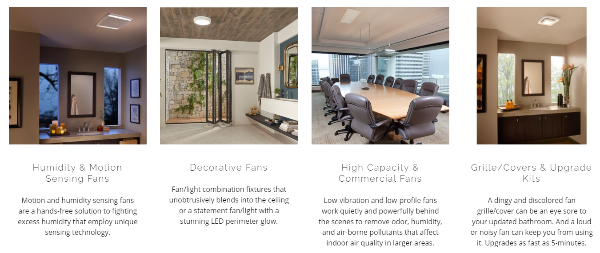
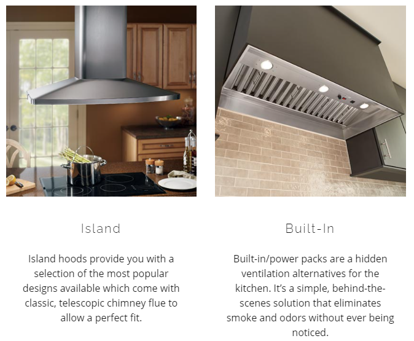
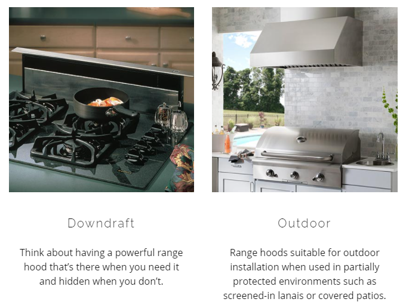
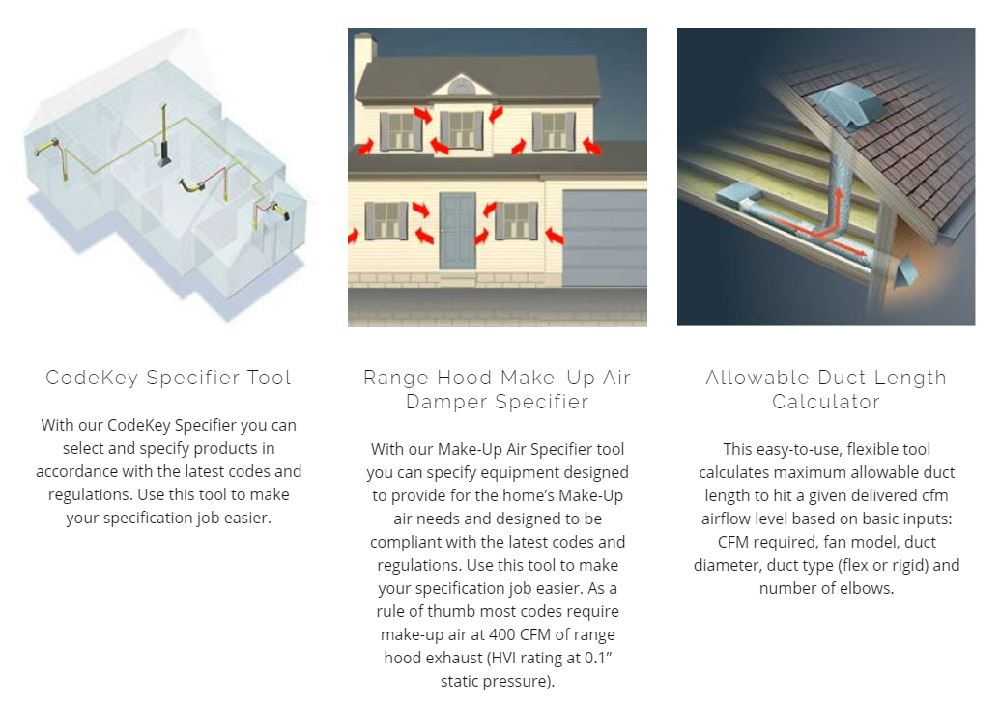
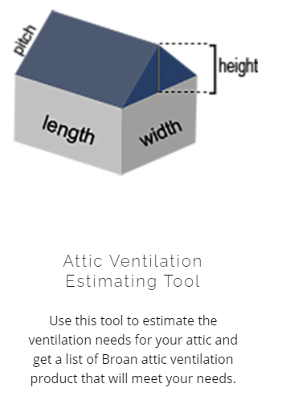
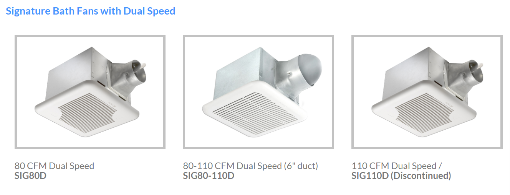
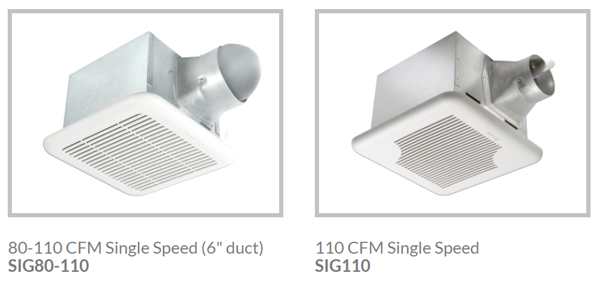
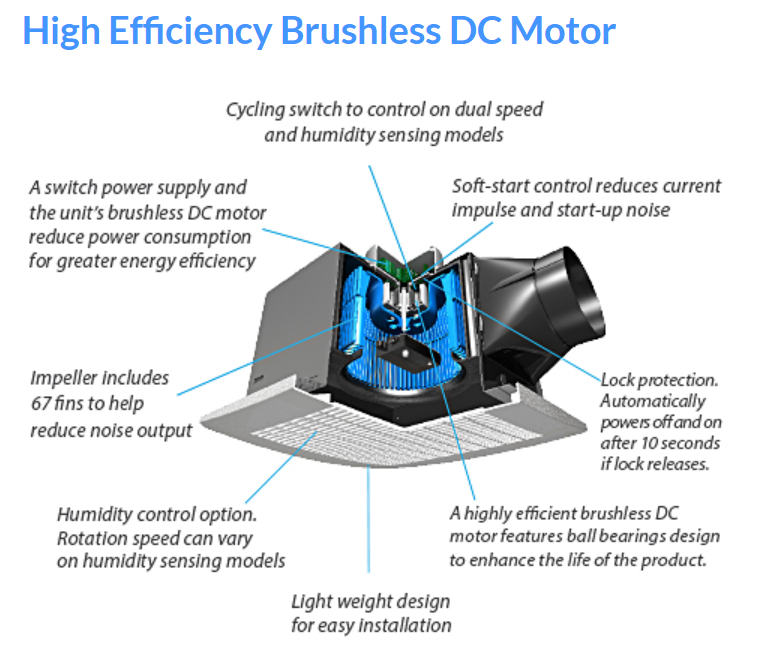

## **Market Competitors**

<br>

[](https://www.broan-nutone.com/en-us)

### Broan Nutone {.tabset .tabset-pills}

Here is an overview of the product lines Broan actively promoted.

* Bath & Exhaust Ventilation Fans

  * **Bluetooth Fans**
  * Decorative & Recessed Fans
  * Fans w/ Lights
  * Fans w/ Heaters
  * Humidity & Motion Sensing Fans
  * High Capacity & Commercial Fans
  * Controls

* Range Hoods

  * Under-Cabinet
  * Wall-Mount Chimney
  * **Wall-Mount Canopy**
  * Island
  * **Built-In / Power Pack**
  * **Downdraft**
  * **Outdoor**

* Fresh Air Systems

* Specialty Ventilation & Heating

  * Heaters
  * **Attic Ventilation**
  * In-Line Fans
  * Utility Fans & Through-Wall Fans
  * **Central Vacuum Systems**

* **Mosquito Repellency**


<br>

#### Heating, Ventilation and Air Conditioning (HVAC)  {.tabset}


<br>

##### Exhaust Fan & Air Supply 

Panasonic offers basically the same range of products in the bathroom ventilation, comparing with Broan. The only product gap highlights in the entertaining experience.

The bluetooth fans from Broan are featured in entertaining the bathing experience with the [ChromaComfort™ fan](https://www.broan-nutone.com/en-us/chromacomfort) combines colorful LED lighting options and [Broan® Sensonic™](https://www.broan-nutone.com/en-us/sensonic) exhaust vent fan with a build-in speaker.

 [](https://www.broan-nutone.com/en-us/bath-exhaust-ventilation-fans)
 [](https://www.broan-nutone.com/en-us/bath-exhaust-ventilation-fans)

<br>

##### Range Hoods

Panasonic range hood products are not as diverse as Broan. They are more traditionally designed and focus on the indoor aspect. 

Whereas Broan has advantages in diverse design in the [build-in and island range hood,500-1500 CFM ](https://www.broan-nutone.com/en-us/product/rangehoods/rmip33), it is one of the leading company in building [downdrift range hoods,500 CFM](https://www.broan-nutone.com/en-us/range-hoods/downdraft) which compatible with both island and traditional cooktop.

 [{width=33%}](https://www.broan-nutone.com/en-us/range-hoods) [{width=31%}](https://www.broan-nutone.com/en-us/range-hoods) [{width=33%}](https://www.broan-nutone.com/en-us/range-hoods)

<br>

##### Fresh Air Systems

BROAN AI SERIES

Fresh Air Systems driven by Virtuo Air Technology 

Broan turned our classic fresh air ventilation line into a single and versatile platform: the AI Series. A platform specifically designed and improved to make your life easier and more profitable, in addition to offering superior air quality.

* Superior air filtration: MERV 8-13
* Premium ECM motors with built-In smart technology
* Ultra-quiet operating environment and 60% energy savings
* Versatile Installation Options

[](https://www.broan-nutone.com/en-us/ai-series)

<br>


##### Heating Fans

Broan features spot heating as one of their speacialty and it introduced 
[Attic ventilation system](https://www.broan-nutone.com/en-us/specialty-ventilation-heating) to prevent heat and moisture build-up, which could extend roof life by preventing rot, premature aging and shingle distortion.

Worth noting that Panasonic has ventilaition fan with similar function. Although [WhisperValue® DC™ Fan, Condensation Sensor](https://na.panasonic.com/us/home-and-building-solutions/ventilation-indoor-air-quality/ventilation-fans/whispervaluer-dctm-fan-condensation-sensor) was advertised for bathroom, it could be a potential multi-purpose solution.

<br>


#### HEPA filters

Panasonic’s global HEPA filter has obvious advantages over Broan's listed catalog. Broan provided two series of  [whole-house solution ventilation fans](https://www.broan-nutone.com/en-us/search?q=HEPA) with CFM rate range in 100-250 CFM. 

* [Advanced Series Energy Recovery Ventilator](https://www.broan-nutone.com/en-us/product/freshairsystems/ervh100s), 100-104 CFM
* [HE Series High Efficiency Heat Recovery Ventilator](https://www.broan-nutone.com/en-us/product/freshairsystems/hrv200te), 210-250 CFM

However, for Panasonic North America, the choice of[ high-efficiency ventilator](https://na.panasonic.com/us/home-and-building-solutions/ventilation-indoor-air-quality/energy-recovery-ventilators/intelli-balancetm-100-balanced-air-50-100cfm) is limited and with a relatively low CFM rate at 50 to 100.


```{r echo=FALSE}
library("htmltools")
library("vembedr")
embed_url("https://www.youtube.com/watch?v=Ra1yP_IiXdg&feature=emb_title")
```


<br>


#### Special Designed tools for customer

Another interesting finding for the Broan is that they have provided some inspiring tools for customers to try out and learn more about their needs for ventilation.

* [CodeKey Specifier Tool](https://tools.broan-nutone.com/whms)
* [Range Hood Make-Up Air Damper Specifier](http://tools.broan.com/muatemplate.aspx)
* [Allowable Duct Length Calculator](https://tools.broan-nutone.com/duct-length/)
* [Attic Ventilation Estimating Tool](https://tools.broan-nutone.com/attic-vents/)

[{width=66%}]() [{width=33%}]()

<br>

Reference:*https://www.broan-nutone.com/en-us*


<br>

### 

[](https://www.deltabreez.com/)

### Delta Breeze {.tabset .tabset-pills}

Here is an overview of Delta's product lines.

* Bath & Exhaust Ventilation Fans
  
  * **Bluetooth Fans**
  * Fans w/ Lights
  * Fans w/ Heaters
  * Humidity & Motion Sensing Fans
  * High Capacity Fans
  
Delta promotes mostly bathroom ventilation. Its lack of HEPA product choices and control panel is less attractive compared to Broan. However, their products highlight the demands for ASHRAE 62.2 & [ENERGY STAR® Most Efficient 2021](https://www.deltabreez.com/energyefficient.php) and focusing on the low-rise multifamily and single housing.


#### Heating, Ventilation and Air Conditioning (HVAC)  {.tabset}

[](https://www.deltabreez.com/)


<br>

##### High-Tier Solutions

[High-Tier Solutions](https://www.deltabreez.com/ASHRAEHighTier.php) have targeted housing from less than 1500 up to 6000 square feet(140-560 square meter).

* Breez Smart:
Engineered to run continuously for a minimum 70,000 hours. Motion-sensing, humidity-sensing, and dual-speed options available with user-adjustable continuous low speed.

* Breez Signature:
Adding innovative brushless DC motor design to *Breeze Elite* with indicator light to show fan is on.

[](https://www.deltabreez.com/breezsmart.php)
[](https://www.deltabreez.com/signature.php)

<br>

##### Competitive Solutions

[Competitive Solutions](https://www.deltabreez.com/ASHRAECompetitive.php)

* Breeze Slim:
Super low profile & Super low energy consumption.

* Breez GreenBuilder:
Built-in lighting with humidity sensor or motion sensor in a power efficient, quiet system

* Breez Signature:
Adding innovative brushless DC motor design to *Breeze Elite* with indicator light to show fan is on.

[](https://www.deltabreez.com/slim.php)

[{width=50%}](https://www.deltabreez.com/greenbuilder.php)[{width=50%}](https://www.deltabreez.com/signature.php)

##### Other Solutions

Other than the most popular lines such as Breez Slim/GreenBuilder, there are versatile alternative products could be compared at [Delta](https://www.deltabreez.com/ChooseAFan.php).  

[]()

There are considerable amount products have been implemented with humidity and motion modules and the product flexibility could be considered as an advantage. 

* Breeze integrity:
Enables to enjoy music or real-time news, compatible with LED light

* Breeze Elite:
Bath fans with single/dual speed, humidity sensor or motion sensor

* Breez Recessed:
Brushless DC motor lasts 70,000 hours for extended reliability.

* Breez Radiance:
Energy saving heater module equipped with thermal cut off fuse with built-in thermostat for consistent temperature.

* Breez Professional:
Powerful airflow extraction for heavier applications but with quiet operation, featuring 6" diameter metal duct adapter while normalone is 4".

* Breez Wall(Mexico only):
Low noise, low power consumption with two models on market,CFM56/165


#### DC Motor Technology

[](https://www.deltabreez.com/dcmotor-tech.php)


* Reliability

  * Delta’s brushless DC motor fans are engineered to outlast popular AC motor models by as much as 70 percent, reducing the need for replacement.

* Less noise

  * Delta’s brushless DC motor fans are precision engineered for low sound, down to less than 0.3 Sones, the lowest sound rating of any exhaust fan.

* Less power consumption

  * Delta’s brushless DC motor fans use up to 74% less power than popular AC motor exhaust fans.

* Efficiency

  * Delta brushless DC motor fans are among the most efficient ventilation fans available, exceeding ENERGY STAR requirements for efficiency by as much as 367%.

**Note: All Delta Breez ventilation fans are precision engineered to run continuously for a minimum 70,000 hours.**


Reference:https://www.deltabreez.com/index.php


